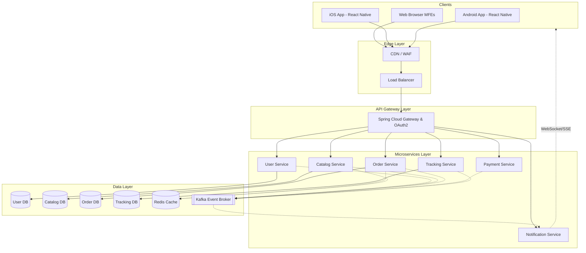
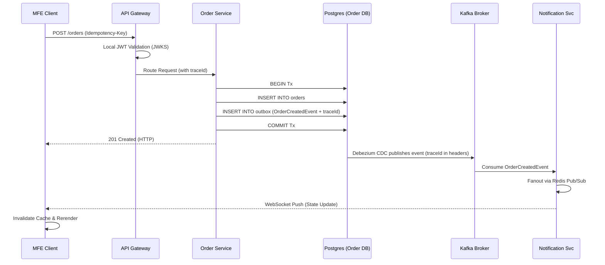

# Detailed Architecture: DYOJ Platform

This document provides an in-depth look at the High-Level Design (HLD), Low-Level Design (LLD), cross-platform client architecture, and the layer-by-layer data flow for the Design Your Own Jewelry (DYOJ) platform.

---

## 1. High-Level Design (HLD)

The HLD outlines the interaction between the Client (Web/Mobile), the API Gateway, the Backend Microservices, and the infrastructure layer (Databases, Cache, Message Broker).

---

## 2. Low-Level Design (LLD) - Data Stream Flow

This section details the layer-by-layer data stream flow, from a user action on the client, through the microservices, and back to another client view.

### Layer 1: Client to Gateway (The Request)

1. **User Action:** A user submits an order in the `dyoj-ui-checkout` MFE.
2. **Local State:** The UI dispatches an action to `Zustand` and triggers a `React Query` POST mutation.
3. **Idempotency:** The UI generates a UUID (`Idempotency-Key`) and attaches it to the header of the REST request.
4. **Transmission:** The request hits the Load Balancer -> API Gateway.

### Layer 2: Gateway to Service (Routing & Security)

1. **Gateway Interception:** Spring Cloud Gateway intercepts the request and injects/passes a unique distributed `traceId`.
2. **Authentication (Stateless):** Validates the JWT token locally using a cached JWKS (JSON Web Key Set), avoiding a network hop to the User Service.
3. **Rate Limiting:** Checks Redis to ensure the user hasn't exceeded the rate limit.
4. **Routing:** Forwards the authenticated request to the `dyoj-order-service`.

### Layer 3: Service to Data (Business Logic & Outbox)

1. **Idempotency Check:** `dyoj-order-service` checks Redis for the `Idempotency-Key`. If present, it returns the cached response.
2. **Business Logic:** Validates the cart and prices.
3. **Transactional Outbox:**
    * Starts a database transaction.
    * Inserts the new order into the `orders` table.
    * Inserts an `OrderCreatedEvent` into the `outbox` table, including the `traceId` for tracing continuation.
    * Commits the transaction.
4. **Response:** Returns a 201 Created to the client. (Client UI optimistic update occurs here).

### Layer 4: Data to Event Broker (CDC & Queueing)

1. **Debezium CDC:** A Kafka Connect process (Debezium) monitors the PostgreSQL WAL (Write-Ahead Log) for the `dyoj_order_db`.
2. **Publishing:** Debezium detects the new row in the `outbox` table and publishes the `OrderCreatedEvent` to the Kafka topic `orders.events`, propagating the `traceId` into the Kafka message headers.

### Layer 5: Broker to Subscribers (Choreography)

1. **Payment Service:** Subscribes to `orders.events`. Consumes the event (reading the `traceId`), initiates a Stripe Payment Intent, and writes a `PaymentPendingEvent` to its own outbox.
2. **Notification Service:** Subscribes to `orders.events`. Consumes the event to notify the user.

### Layer 6: Service to Client (Realtime Update)

1. **Fanout Backplane:** The specific `dyoj-notification-service` pod that consumed the Kafka event might not hold the user's active WebSocket connection. It publishes the payload to a **Redis Pub/Sub channel**.
2. **WebSocket Push:** All `dyoj-notification-service` replicas listen to Redis. The replica holding the user's socket pushes the JSON payload `{"type": "ORDER_STATUS_CHANGED", "orderId": "123", "status": "PENDING_PAYMENT"}` to the client.
3. **Client Invalidation:** The MFE receives the WebSocket message, publishes an event on the Frontend Event Bus, causing `React Query` to invalidate the `['orders']` cache and fetch fresh data, rendering the UI update.

---

## 3. Client Architecture & Cross-Platform Scaling

The UI architecture must support distinct Web Microfrontends and scale effortlessly to iOS and Android applications.

### Web Microfrontend (MFE) Architecture

* **Implementation:** Vite Module Federation.
* **Shell Application (`dyoj-ui-shell`):** Acts as the orchestrator. It handles routing, global authentication context, and sets up the Global Event Bus (using the native `CustomEvent` API or a lightweight Pub/Sub utility).
* **Remote Applications (`dyoj-ui-catalog`, `dyoj-ui-checkout`):** These are independently deployable React applications. They expose specific components or pages.

**Inter-MFE Communication Example:**

1. User adds an item to the cart in `dyoj-ui-catalog`.
2. `dyoj-ui-catalog` calls the backend API and on success, dispatches a Custom Event: `window.dispatchEvent(new CustomEvent('CART_UPDATED', { detail: { count: 1 } }))`.
3. The Header component (owned by `dyoj-ui-shell`) listens for `CART_UPDATED` and updates the cart badge icon.

### Scaling to Mobile (iOS / Android)

To avoid duplicating business logic across three platforms (Web, iOS, Android), we will adopt **React Native (Expo)** alongside our Web React application, sharing a core business logic library.

1. **Monorepo Structure (Frontend):**
    * `packages/core-logic`: Shared TypeScript hooks, Zustand stores, API clients (Axios/React Query), and validation schemas (Zod).
    * `apps/web-shell`: The Vite MFE host.
    * `apps/web-catalog`: The Vite MFE remote.
    * `apps/mobile-app`: The React Native (Expo) application.

2. **Mobile Implementation:**
    * React Native does *not* support Webpack/Vite Module Federation in the same way browsers do. Therefore, the mobile app will be built as a single, modular React Native binary.
    * The `mobile-app` imports the exact same business logic (`packages/core-logic`) as the Web MFEs. Only the presentation layer (UI Components like `div` vs `View`) differs.
    * WebSockets operate identically in React Native, allowing the exact same real-time tracking flow on iOS and Android.

3. **Backend Agnosticism:**
    * The backend microservices remain completely agnostic to the client. The API Gateway serves Web, iOS, and Android clients equally, identifying them via JWT tokens.
